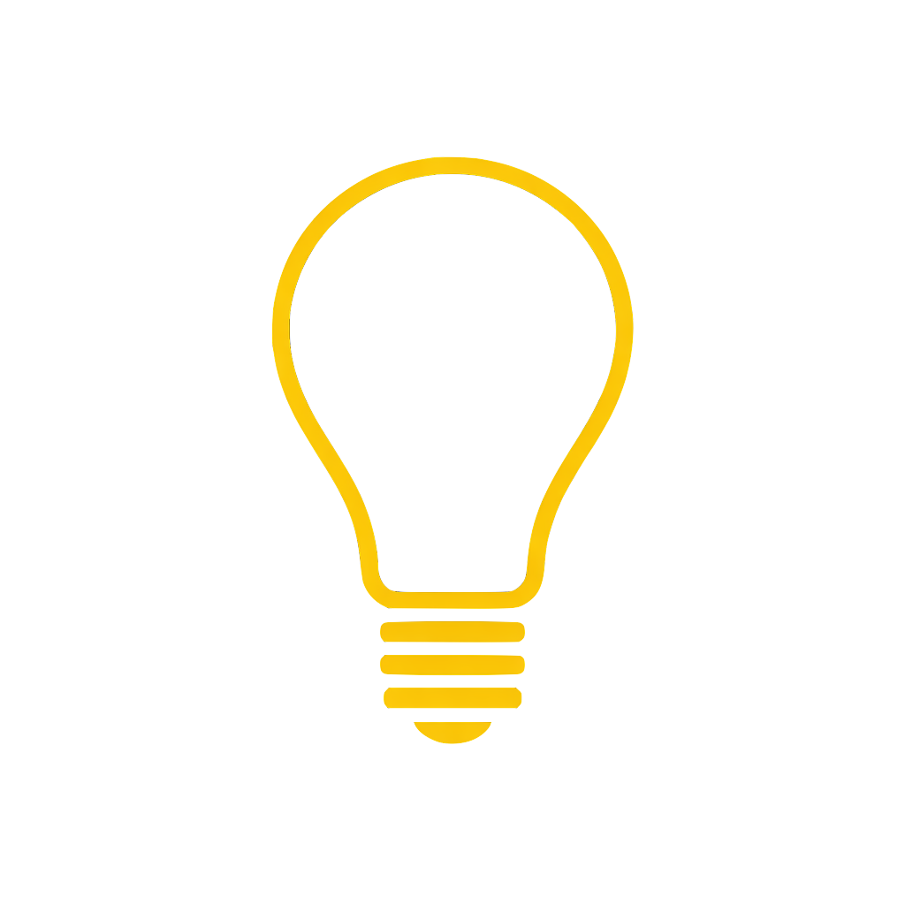

# Hi 👋, I'm Robert

A **Full-Stack Web Developer** with an economist's mindset and a modern web toolkit.
 
For four years, I worked in risk management, turning messy data into clear answers with R and serving as product owner for an external web app. The part I enjoyed most was the building itself — so I decided to do it full-time.
 
I recently graduated from Le Wagon's 9-week AI Software bootcamp, where I went deep on Ruby on Rails, JavaScript, databases, and more, and shipped several applications from scratch — including leading two team projects that taught me how rewarding collaborative development can be. Integrating AI assistents into real products was a highlight.
 
What I bring: strong analytical thinking, the product sense that comes from having sat on the other side of the table, a commitment to clean and maintainable code, and the ability to pick up new tools quickly.

I'm now looking for my first full-time role as a full-stack developer or software engineer — ideally on a team that values ownership, quality, and curiosity.

🚀 Let's connect — I'd love to hear what you're building.

<h3 align="left">Connect with me:</h3>

  &nbsp;
  

<h3 align="left">🛠️Languages and Tools:</h3>

  &nbsp;
  &nbsp;
  &nbsp;
  &nbsp;
  &nbsp;
  &nbsp;
  &nbsp;
  &nbsp;
  &nbsp;
  &nbsp;
  &nbsp;
  &nbsp;
  &nbsp;
  &nbsp;
  &nbsp;
  &nbsp;
  &nbsp;
  &nbsp;
  

### Projects:

<h3> <a href="https://github.com/Robert-w1/voxify">Voxify</a></h3>

AI-powered presentation coach built in a team of three as a bootcamp project. Record yourself, receive relevant and individual feedback and improve your presentation skills.

<b>My contribution</b>

Backend (Ruby on Rails) · Audio recording & processing (MediaSourceAPI, JavaScript Stimulus) · Speech-to-text transcription (Deepgram API) · LLM feedback generation (OpenAI API)· Tests (model, controller, job, system and JavaScript unit) · CI (Github Actions)

<h3> <a href="https://github.com/Robert-w1/prompt-app">Luminary</a></h3>

Most people type a question and hope for the best. Luminary turns what you actually mean into a prompt that makes AI perform at its ceiling. Built in a team of four as a bootcamp project.

<b>My contribution</b>

Backend (Ruby on Rails) · LLM implementation (OpenAI API)· Frontend (HTML, CSS, JavaScript)

